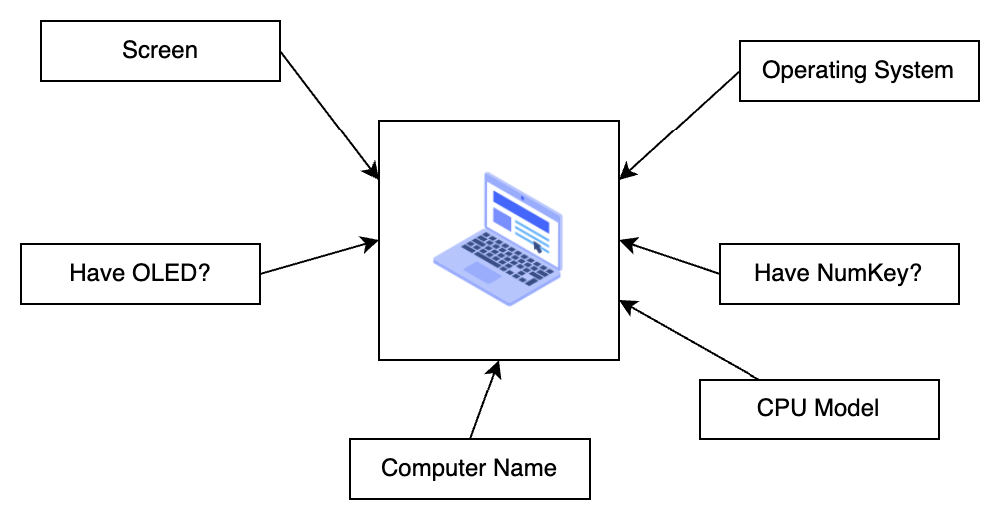

# Section 1: Introduce to OOP

In this section, we will trying to provide an overview of OOP with an simple example about laptop.


## Why we need OOP?

### Define the issue

Imagine we trying to describe this laptop...


If we trying to describe this laptop, we can write a code like that:

```c++
int screen_pixel = 14;
bool have_OLED = true;
std::string computer_name = "It's a cool computer";
std::string cpu_model = "Letni i9-48763 4.87GHz";
bool have_numkey = true;
std::string operating_system = "Windows";
```

OK, LGTM. But if there have another new laptop...



We need more variable to describe that.

```c++
int screen_pixel_1 = 14;
bool have_OLED_1 = true;
std::string computer_name_1 = "It's a cool computer";
std::string cpu_model_1 = "Letni i9-48763 4.87GHz";
bool have_numkey_1 = true;
std::string operating_system_1 = "Windows";

int screen_pixel_2 = 14;
bool have_OLED_2 = true;
std::string computer_name_2 = "It's an another cool computer";
std::string cpu_model_2 = "M9";
bool have_numkey_2 = false;
std::string operating_system_2 = "macOS";
```


And more computer need more variable.

```c++
int screen_pixel_1 = 14;
bool have_OLED_1 = true;
std::string computer_name_1 = "It's a cool computer";
std::string cpu_model_1 = "Letni i9-48763 4.87GHz";
bool have_numkey_1 = true;
std::string operating_system_1 = "Windows";

int screen_pixel_2 = 14;
bool have_OLED_2 = true;
std::string computer_name_2 = "It's an another cool computer";
std::string cpu_model_2 = "M9";
bool have_numkey_2 = false;
std::string operating_system_2 = "macOS";

int screen_pixel_3 = 14;
bool have_OLED_3 = true;
std::string computer_name_2 = "It's an another another cool computer";
std::string cpu_model_3 = "M9";
bool have_numkey_3 = false;
std::string operating_system_3 = "macOS";

int screen_pixel_4 = 14;
bool have_OLED_4 = true;
std::string computer_name_4 = "It's an another another another cool computer";
std::string cpu_model_4 = "M9";
bool have_numkey_4 = false;
std::string operating_system_4 = "macOS";

// Hey! Too much variable. :angry:
```


In this case, the code should be work. But have some issue:

- Hard to maintain. If we have 6 computer, we need 36 lines to describe the computer. It's redundant and can be simplified.

- If we need a new computer, we need more 6 lines to describe the computer. It's redundant also.

- It seems that can be simplify. There have lot of the same attributes that can be simplify.

  For example:  `operating_system_1`, `operating_system_2`, and `operating_system_3` have the same attributes `operating_system`.


### Movitation

Maybe we can extract the attribute? 

In this case, we have a blueprint that can construct the laptop.


As we have a blueprint, we can setup the attribute and construct the laptop.


Therefore, we can construct three computer with only three lines of code!


