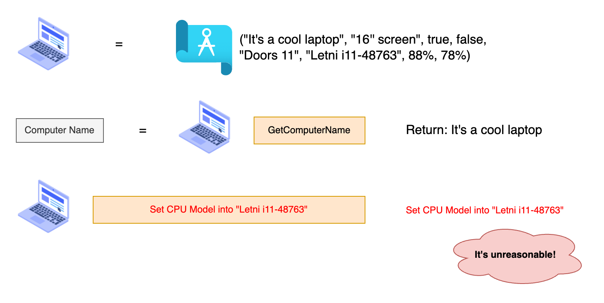
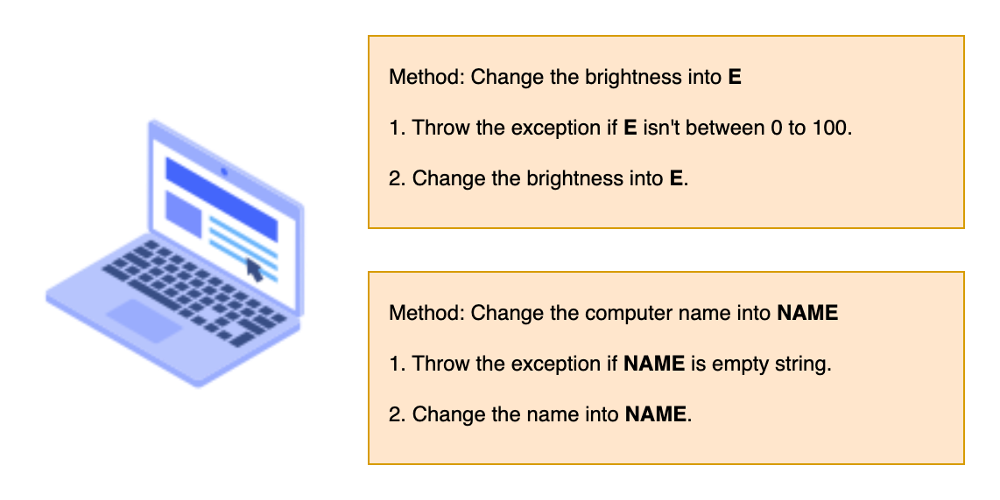

# Encapsulation

## Why we need encapsulation?

We provide some function to change the state of laptop. For example, change the brightness, change the computer name...

But consider these situation:

- How about change the Model of CPU?
- How about change the brightness into 48763%? The value is over than 100%, how it possible?

It's impossible to change the CPU when the laptop is constructed. Moreover, it also impossible to change the brightness over than 100%.

So, we need to check before we change the state. That's the reason why we need encapsulation.

## What's encapsulation?

The encapsulation in OOP is trying to check the state is fulfill when we trying to change into specific state.

For example, if we trying to perform these operations:

| Operations                                             | Is it OK? | Reason                                                     |
| ------------------------------------------------------ | :-------: | ---------------------------------------------------------- |
| Trying to change the brightness into 45%               |    OK     | You can change the brightness of the laptop into 45%.      |
| Trying to change the laptop name into "It's my laptop" |    OK     | You can change the laptop name with any non-empty name.    |
| Trying to change the CPU Model                         |    NO     | You can't change the CPU model when laptop is constructed. |
| Trying to change the brightness into 48763%            |    NO     | The brightness should between 0% to 100%.                  |

There have some operations we need to prevent it performed. We will talk about how it works.

## How to do encapsulation?

We have lot of functions to change the state in the laptop. The way to do Encapsulation is checking state we would like to replace before we perform the operation.

For example, when trying to change the brightness, should check the brightness should between 0% to 100%. Otherwise, should throw exception when the state is not fulfilled.

There have another good example. When trying to change the name, should check the name should be non-empty. Otherwise, should throw exception when the state is not fulfilled.

Good encapsulation should consider the user may input some abnormal state into function and prevent these state changed into the object and cause some abnormal situtation happened.
