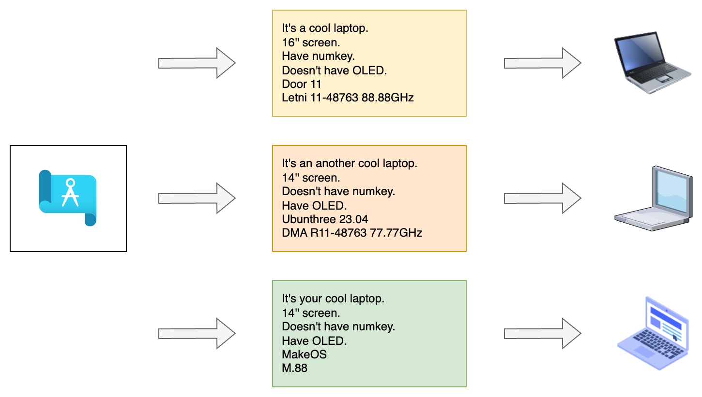
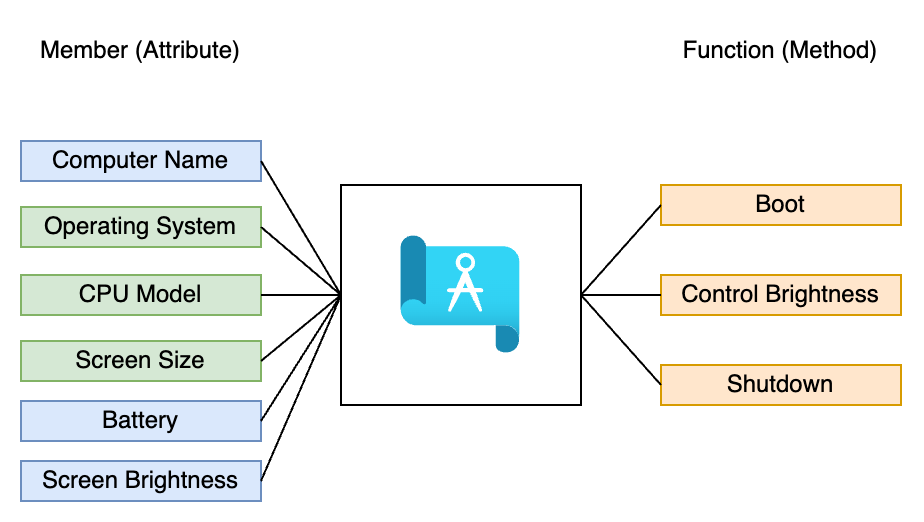
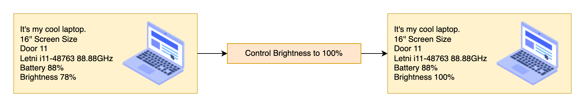
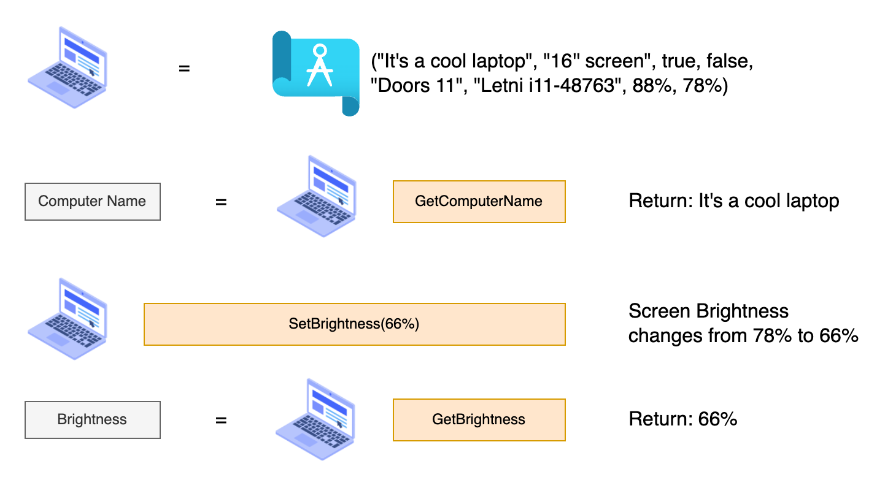

## What's OOP

### Introduce to OOP

OOP is a principle that have object concept.

- It's kind a blueprint. You can design a object like design a blueprint. (Design a class)
- You can create a object according to the blueprint. (Implement a object)



### How do you design a class

In the following image, the blueprint (class) can split into two parts. One is member, and another is function.

- For a member, we have computer name, operating system, CPU model, screen size, it record the state of laptop.

- For a function, we have some function that can boot, control the brightness, or shutdown the laptop. It change the state of laptop.



### How do you implement a object

Once we have a blueprint, we can setup some attribute and implement a laptop as a object.


### Control the object

When we have a object (that is, laptop), we can control the laptop with function!



### How do we write the code

We can practice the idea with code. It will look like this:



Actually it will look likes:

```cpp
Computer computer = Computer("It's a cool laptop", "16'' screen", true, false, "Doors 11", "Letni i11-48763", 0.88, 0.78);

std::string name = computer.GetName(); // Return "It's a cool laptop" string

computer.setBrightness(0.66); // Set brightness from 78% into 66%

double brightness = computer.GetBrightness(); // Return 0.66 (66%)
```

The above code shows how the OOP works. With Computer class, we can put some attribute into Computer class, and create a computer object.

We can control the object by using its function. For example, we can call `GetName()` function to get name and call `setBrightness(0.66)` to set the brightness into 66%.

Compare previous examples, we can put any attributes and it will create the computer by the attributes. We don't need to create lot of variables to describe a laptop. Instead, we use only one object to present laptop, which is more clarify and easy to know.

In this section, we provide some example to describe how OOP works. In the next section, we will describe some topic about OOP with an overview. It will help when you deep dive these topic.
